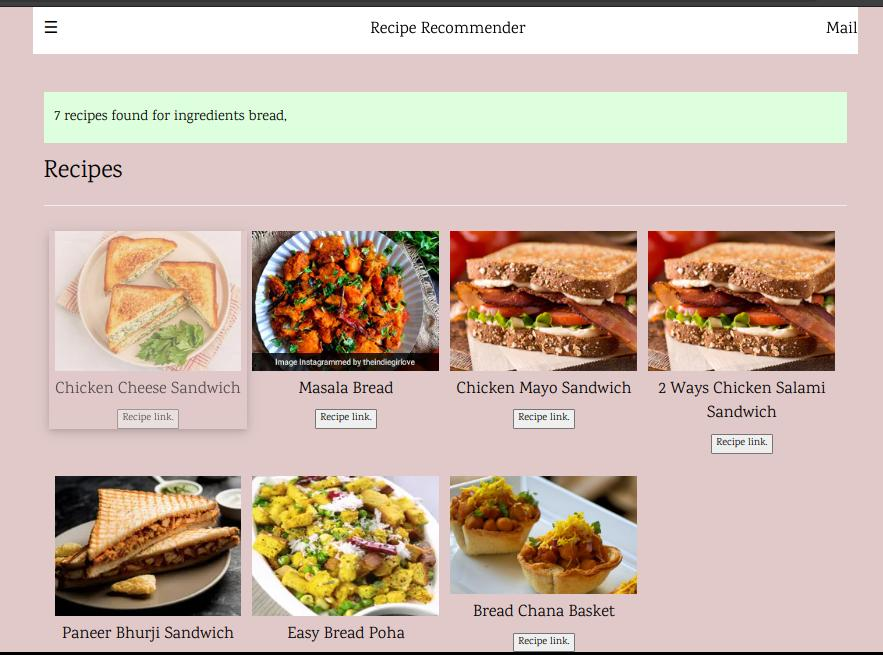

# Recipe Recommender System

## About

This work presents a recipe recommender as a graph database, Neo4j application. 
Given any set of ingredients,this application recommends a variety of recipes with the help of a data set 
containing thousands of ingredients. Further based on availability of ingredients with a user,
this application helps discover the list of possible dishes with these ingredients.
In order to implement this application, ingredients and recipes have been
crawled from cookery based websites using Python scripts.

## Motivation 

Nowadays a lot of ingredients are available in the
market but there is a lack of idea about what to make or what
all that can be made from the available ingredients. Rather than
buying new ingredients and making the same old dish and
wasting money and time to make some old dish, we can make
a new dish from the available ingredients.

### click image for video

[](https://youtu.be/nO5bOLq9KHA "click here")

## Tech Stack
- [Neo4j](https://neo4j.com/)
- [cypher](https://neo4j.com/developer/cypher/)
- [Nodejs](https://nodejs.org/en/docs/guides/)

## Setup 

### Database
- Therefore, in order to store the large data of the recipes and ingredients, the application has used Neo4j database.
- Download and install `noe4j`
  [https://neo4j.com/download/](https://neo4j.com/download/)
- Open `neo4j` and create `New Project`
- Name the project `Recipe Recommendation`
- Create a new database `Recipes` and set password `123`
  and select the `Graph DB` as its type.
- Now import the `csv file for into the project
  [Resource](https://neo4j.com/developer/desktop-csv-import/)
- Now create the associations

`cypher query`
```
LOAD CSV WITH HEADERS FROM 'file:///recipes_img.csv' AS row
WITH row WHERE row.name IS NOT NULL
MERGE (rec:recipe {name: row.name, time:row.time, link:row.link, image:row.image})
WITH rec, row
UNWIND split(row.ingredient, ',') AS i
MERGE (c:ingredient {name:  lTrim(rTrim(i))})
MERGE (rec)-[r:NEED]->(c)
```

Note:

- Neo4j database internal structure
  - Neo4j desktop store database inside its application folder 
    (`~/.config/Neo4j Desktop/relate-data/dbmss` on linux).
  - Each database have its own folder (e.g. `dbms-9ffccc4b-5842-4e9a-91d8-7b1edd4a53b4`)
  - The `.csv` file to be imported are stored in the `/import` subdirectory.

### Starting web app

- `cd nodejs-app`
- `npm install` - install node modules
- `node app` - launch node app

#### For development

- `npm install nodemon -g`
- `nodemon`
## Reference
- [Neo4j Case Study](./Research-paper/Neo4j-case-study-Gousto-EN-A4.pdf)
- [Research Paper](./Research-paper/Recomend-System.pdf)
# License

[MIT](./LICENSE)
